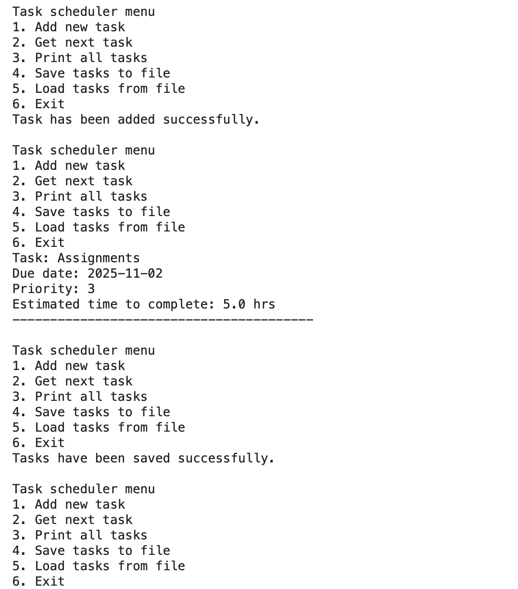
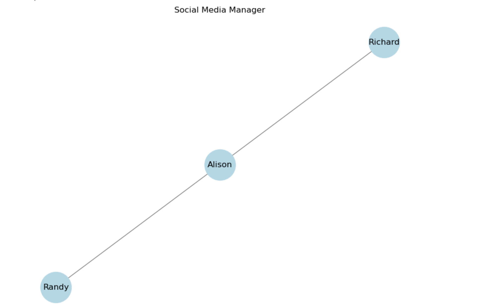

# Data Structures and Algorithms — Python

Python implementations of two data structure problems: a task scheduling system using heaps, and a social media connections manager using graphs.

## Overview

This repository contains two Jupyter notebooks, each implementing a different data structure to solve a practical problem, built as part of the ITDPA module.

## Projects

### 1. Task Scheduling System (Heaps)
Implements a priority-based task scheduler using a heap data structure, allowing tasks to be scheduled and retrieved in priority order.

**File:** `ITDPA Question1 Task Scheduling.ipynb`

### 2. Social Media Connections Manager (Graphs)
Implements a graph-based system for managing and analysing connections between users, similar to a simplified social network structure.

**File:** `ITDPA Question 2 Social Media Manager.ipynb`

## Screenshots

**Task Scheduler — Console Output**

Console menu showing task creation, priority-based retrieval, and saving/loading tasks to file.

**Social Media Manager — Connection Graph**

Graph visualisation showing user connections, with Alison connected to both Randy and Richard.

## Tech Stack

- **Language:** Python
- **Environment:** Jupyter Notebook
- **Core concepts:** Heaps, Graphs, algorithm design and analysis

## Getting Started

1. Clone the repository
2. Open either notebook in Jupyter Notebook or JupyterLab
3. Run the cells in order to see the implementation and output

## Notes

These implementations focus on applying core data structure concepts to real-world-style problems, with an emphasis on correct algorithm design over interface or presentation.

## Developer

**Kayla Abdul Ganie**

BSc Information Technology – Software Engineering  

Eduvos

GitHub: [@kayla014](https://github.com/kayla014)
kayla014 - Overview
BSc IT (Software Engineering) Student at Eduvos | Software Engineering Student - kayla014
